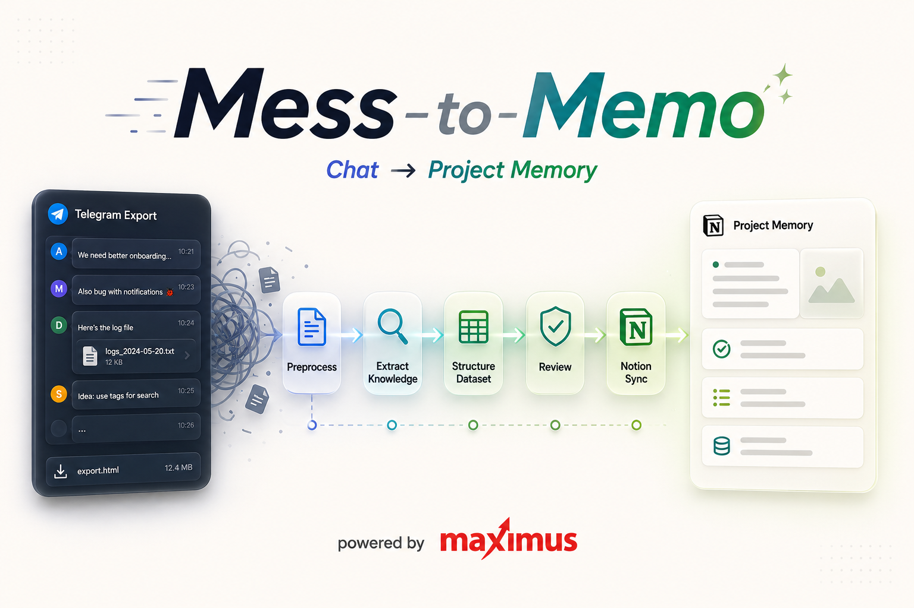

# Mess-to-Memo



Convert Telegram project chats into a reviewed knowledge dataset and a local Notion-ready documentation package.

Mess-to-Memo gives Codex a repeatable path for noisy chat history:

`install skill -> provide result.json or result_toon.md -> receive notion-ready/`

The package preserves project decisions, API rules, onboarding notes, mobile behavior, UI decisions, solved issues, and useful links. It removes chat noise and flags sensitive material before you publish anything.

## Repository Contents

- `skills/` contains installable skills
- `docs/` contains repo-level documentation
- `scripts/` contains helper utilities
- `templates/` contains reusable artifacts
- `examples/` contains example inputs and outputs

## Current Skills

- `mess-to-memo`

## What Mess-to-Memo Does

Use the skill to:

- gather Telegram exports and supporting project materials;
- preprocess Telegram `result.json` or Toon-style `result_toon.md`;
- extract reusable project knowledge from chat history;
- write a compact `knowledge_dataset.json`;
- generate category pages under `notion-ready/`;
- create `processing-report.md` and `publish-manifest.json`;
- review redactions before Notion publication.

## Primary Flow

Run the one-step command when you want the practical handoff package:

```bash
python3 scripts/normalize_telegram_export.py \
  --input /path/to/result_toon.md \
  --output /path/to/preprocessed \
  --project-name "Project Name" \
  --notion-output /path/to/notion-ready
```

The command writes the intermediate dataset and the Notion-ready package in one run. Use `result.json` instead of `result_toon.md` when you have the native Telegram export.

The installable skill bundle includes the same scripts under `skills/mess-to-memo/scripts/`, so Codex can run the same flow after GitHub installation.

## Local Preprocessing

The Python normalizer accepts:

- Telegram export `result.json`
- Toon-style markdown exports such as `result_toon.md`

```bash
python3 scripts/normalize_telegram_export.py \
  --input /path/to/result.json \
  --output /path/to/preprocessed
```

It produces:

- `messages_normalized.jsonl`
- `conversation_chunks.jsonl`
- `knowledge_candidates.jsonl`
- `knowledge_dataset.json`
- `redaction_report.json`
- `category_summary.json`

The normalizer keeps URLs by default because design files, specs, tickets, and API docs often carry project knowledge. Add `--redact-urls` when links contain sensitive information.

See [docs/preprocessing-pipeline.md](docs/preprocessing-pipeline.md) for the preprocessing workflow.

## Preprocessing Language Support

The normalizer preserves Unicode text from Telegram exports. Heuristic categorization includes keyword support for:

- English
- Ukrainian
- Spanish
- Portuguese
- French
- German
- Polish
- Turkish
- Arabic
- Hindi
- Indonesian
- Vietnamese

Other languages still pass through intact. Category hints may fall back to `General` more often.

## Example Preprocessing Impact

On a representative project chat export, local preprocessing reduced the material before final review like this:

- Raw export: about `1,000+` messages and `500 KB` of chat text.
- Useful messages after preprocessing: about `20-25%` of the total.
- Noise filtered out: about `75-80%` of raw messages.
- Conversation chunks created: dozens of reviewable candidate discussions.
- Final reusable knowledge items: a smaller set of verified or needs-review records.
- Sensitive values caught early: phones, token-like values, URLs, emails, and Telegram message IDs.
- Final outputs: no Telegram message IDs exposed when the safety rules are followed.
- Compression from raw chat to final project memory can be around `98%+` for noisy chats.

Numbers vary with chat style, project phase, and operational chatter. The value comes from doing parsing, noise filtering, chunking, and first-pass redaction before any reasoning step.

## Build A Notion-Ready Package

Build local Notion-ready pages from an existing dataset:

```bash
python3 scripts/build_notion_package.py \
  --dataset /path/to/knowledge_dataset.json \
  --output /path/to/notion-ready \
  --project-name "Project Name" \
  --source-export result_toon.md
```

Package existing Markdown pages when you already wrote the page content:

```bash
python3 scripts/build_notion_package.py \
  --pages-dir /path/to/notion-pages \
  --output /path/to/notion-ready \
  --project-name "Project Name" \
  --source-export manual-pages
```

## Install Into Codex

From a local checkout:

```bash
scripts/install-to-codex.sh
```

From GitHub with the Codex skill installer, use the skill path:

```bash
install-skill-from-github.py --repo OWNER/REPO --path skills/mess-to-memo
```

Manual user-level install:

```bash
mkdir -p ~/.codex/skills
cp -R skills/mess-to-memo ~/.codex/skills/
```

Manual project-level install:

```bash
mkdir -p .agents/skills
cp -R skills/mess-to-memo .agents/skills/
```

## Directory Tree

```text
mess-to-memo/
├── README.md
├── .gitignore
├── docs/
├── examples/
├── scripts/
├── skills/
└── templates/
```

## Notes

- The repo ships one production skill: `mess-to-memo`.
- The helper scripts use Python standard library modules only.
- `publish-manifest.json` stores Notion page IDs and URLs after publication.

---

Built by [Maximus Studio](https://maximus.pro/) — production-grade mobile and web software, backed by 20+ years of experience.
